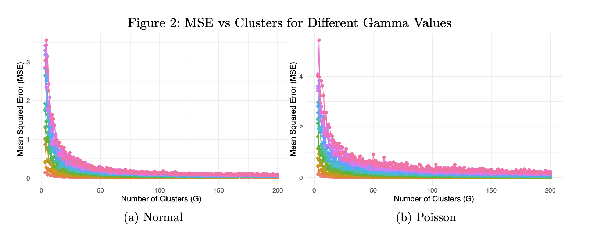

# Simulation Studies on Optimal Experimental Design under Budget Constraints

[View the full report here](Reports/Report.pdf)

## Abstract

This study investigates optimal experimental designs under budget constraints through comprehensive simulation studies, focusing on clustered study designs where treatments are assigned at the cluster level. Using the ADEMP framework, we systematically examined how the number of clusters ($G$) and observations per cluster ($R$) influence estimation accuracy under various parameter configurations and cost constraints. Our simulations explored both normal and Poisson-distributed outcomes, incorporating key parameters including treatment effect size ($\beta$), between-cluster variance ($\gamma^2$), within-cluster variance ($\sigma^2$), and the ratio of cluster to individual-level costs ($c_1/c_2$). Results show that while the mean parameters ($\alpha$, $\beta$) had negligible impact on optimal designs, variance components significantly influenced design efficiency. Higher between-cluster variance generally favored designs with more clusters and fewer observations per cluster, particularly for Poisson-distributed outcomes. The cost ratio emerged as a crucial determinant, with higher $c_1/c_2$ ratios leading to fewer but larger clusters. These findings provide practical guidance for researchers designing cluster-randomized trials under budget constraints, demonstrating how to optimize resource allocation between clusters and within-cluster observations based on distributional assumptions, variance components, and cost structures.

## Selected Tables and Figures



**Table 4: Optimal Designs for Different C1/C2 Ratio**

**(a) Normal**
| c1 | OptimalMSE | G | R | Cost |
|---:|---:|---:|---:|---:|
| 2 | 0.0297566 | 429 | 1 | 858 |
| 3 | 0.0399331 | 214 | 2 | 856 |
| 4 | 0.0492680 | 180 | 2 | 900 |
| 5 | 0.0562573 | 162 | 2 | 972 |
| 6 | 0.0655591 | 85 | 6 | 935 |
| 7 | 0.0697480 | 99 | 4 | 990 |
| 8 | 0.0794216 | 83 | 5 | 996 |
| 9 | 0.0864997 | 91 | 2 | 910 |
| 10 | 0.0953008 | 82 | 3 | 984 |
| 11 | 0.1012274 | 54 | 8 | 972 |
| 12 | 0.1081789 | 58 | 6 | 986 |
| 13 | 0.1143881 | 54 | 6 | 972 |
| 14 | 0.1212100 | 49 | 7 | 980 |
| 15 | 0.1244390 | 58 | 3 | 986 |
| 16 | 0.1407954 | 48 | 5 | 960 |
| 17 | 0.1392162 | 45 | 6 | 990 |
| 18 | 0.1400984 | 49 | 3 | 980 |
| 19 | 0.1451432 | 40 | 7 | 1000 |
| 20 | 0.1599335 | 37 | 8 | 999 |

**(b) Poisson**
| c1 | OptimalMSE | G | R | Cost |
|---:|---:|---:|---:|---:|
| 2 | 0.0278507 | 497 | 1 | 994 |
| 3 | 0.0380881 | 326 | 1 | 978 |
| 4 | 0.0474146 | 248 | 1 | 992 |
| 5 | 0.0542624 | 197 | 1 | 985 |
| 6 | 0.0646235 | 161 | 1 | 966 |
| 7 | 0.0747754 | 130 | 1 | 910 |
| 8 | 0.0833207 | 100 | 3 | 1000 |
| 9 | 0.0874934 | 102 | 1 | 918 |
| 10 | 0.0983416 | 95 | 1 | 950 |
| 11 | 0.1055769 | 88 | 1 | 968 |
| 12 | 0.1084739 | 81 | 1 | 972 |
| 13 | 0.1224630 | 74 | 1 | 962 |
| 14 | 0.1193571 | 68 | 1 | 952 |
| 15 | 0.1303207 | 63 | 1 | 945 |
| 16 | 0.1380758 | 60 | 1 | 960 |
| 17 | 0.1480772 | 56 | 1 | 952 |
| 18 | 0.1472453 | 53 | 1 | 954 |
| 19 | 0.1543376 | 52 | 1 | 988 |
| 20 | 0.1608175 | 47 | 2 | 987 |

## Conclusion
Our simulation studies on optimal experimental design under budget constraints reveal that the efficiency of cluster-randomized trials is primarily driven by variance components and cost structures rather than mean parameters. The between-cluster variance emerged as a particularly crucial factor, with higher values generally favoring designs with more clusters and fewer observations per cluster. This pattern was especially pronounced for Poisson-distributed outcomes, where the log-link function amplifies the impact of between-cluster heterogeneity.

The cost ratio between cluster-level and individual-level sampling proved to be a key determinant in optimal design configuration. While higher cost ratios generally led to designs with fewer but larger clusters, the transition pattern differed between normal and Poisson distributions. These findings provide practical guidance for researchers in allocating limited resources efficiently across clusters and within-cluster observations. The simulation code and results are available in this repository, offering a framework for researchers to explore optimal designs under their specific constraints and distributional assumptions.

## Project Structure

```bash
simulation-studies-on-optimal-experimental-design-under-budget-constraints
├── Figures
│   └── image.png
├── README.md
├── Reports
│   ├── Report.pdf
│   └── Report.qmd
├── Results
│   ├── design_performance_normal_alpha.csv
│   ├── design_performance_normal_beta.csv
│   ├── design_performance_normal_c1_c2.csv
│   ├── design_performance_normal_gamma2.csv
│   ├── design_performance_normal_sigma2.csv
│   ├── design_performance_poisson_c1_c2.csv
│   ├── design_performance_poisson_gamma2.csv
│   └── design_performance_poisson_sigma2.csv
└── LICENSE
```